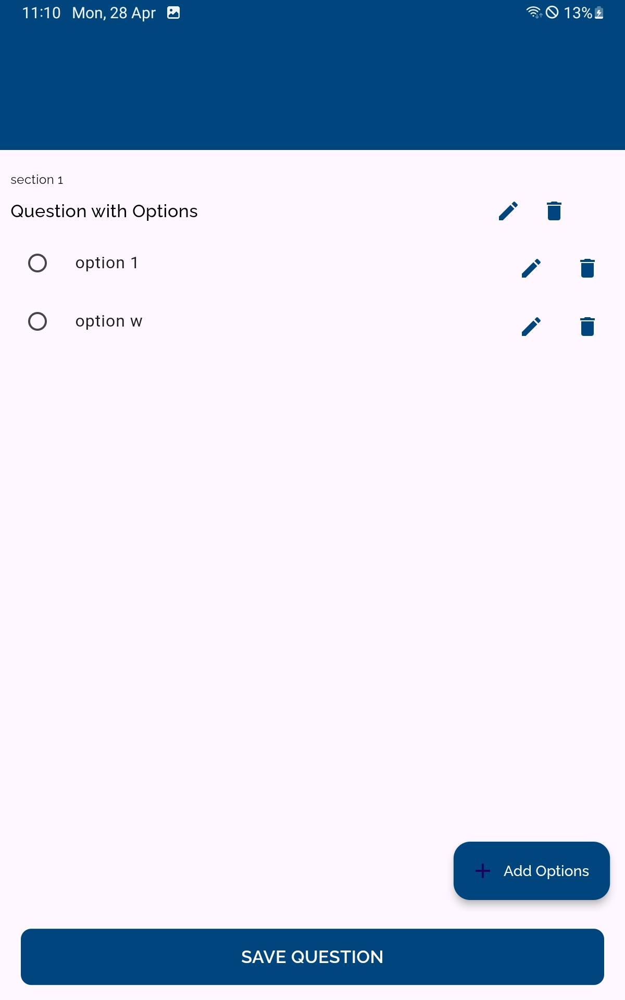

# Snappoll-a-Survey-System
## Survey System (Flutter & Dart)

A **cross-platform survey application** built with **Flutter (Dart)** for **mobile** and **web**.  
This system was developed as part of a **university-based project** at **Otto-Friedrich-University Bamberg**, aimed at building a full-fledged survey solution for academic and commercial use. It enables users to create and manage surveys, share them via QR codes, collect and analyze responses, and manage access rights seamlessly across different platforms.

The project is designed to be versatile and scalable, making it a perfect tool for academic institutions, businesses, and individuals who need to conduct surveys efficiently. It can be used for market research, academic research, feedback collection, event planning, and customer satisfaction surveys. The easy-to-use interface ensures that users with little technical knowledge can create and distribute surveys. With mobile and web compatibility, participants can conveniently complete surveys on any device. The platform ensures data security and anonymity, making it ideal for sensitive surveys. Future updates aim to enhance real-time analytics and support additional languages. Overall, this project is a robust, ready-to-deploy survey management system.

---

## 🚀 Features

- **Create Leads and Manage Access**: Organize and control survey access among different users and teams.
- **QR Code Sharing for Surveys**: Instantly generate and share QR codes for quick survey access.
- **Scan QR Code to Access Surveys**: Scan QR codes to directly access publicly available or private surveys.
- **Survey Templates Creation**: Design and reuse custom templates to speed up survey creation.
- **Multiple Question Types**:
  - **Single Choice**: Select one option from a list.
  - **Multiple Choice**: Choose multiple answers.
  - **Rating**: Rate items on a numeric scale.
  - **Multi Rating**: Rate multiple aspects simultaneously.
  - **Yes/No**: Simple binary choice.
  - **Open Text Input**: Free-form text responses.
- **Speech to Text for Open Text Questions**: Use voice input for open text responses, making it easier to answer lengthy questions.
- **Survey Progress Bar**: A progress bar at the top indicates how much of the survey has been completed while answering.
- **Suggestion Option for Questions**: If a user prefers not to answer a question, they can leave a suggestion instead.
- **Mandatory Answering**: Currently, answering all questions is mandatory to complete a survey.
- **Drag and Drop Question Ordering**: Easily change the hierarchy of questions via drag-and-drop functionality, organized into sections for better clarity and usability.
- **User Authentication**: Secure login and registration system to protect data and personalize user experience.
- **Multi-language Support**: Currently supporting **German** in addition to English.
- **Mobile and Web Compatible**: Designed for seamless use across smartphones, tablets, and web browsers.
- **Export Survey Results to CSV**: Save survey results in CSV file format for easy sharing and further analysis.
- **Response Timing**: Track the time each user takes to answer each question.
- **Privacy and Data Protection**: No personal data is collected from survey respondents, ensuring complete anonymity and data security.

---

## 📱 Screenshots

> *(Add your screenshots here to show the flow!)*

| Feature | Screenshot |
| :--- | :--- |
| Home Page |  |
| Create Survey |  |
| QR Code Sharing |  |
| Answering Survey |  |
| Single Choice Question |  |
| Questions Available |  | 
| Manage Surveys |  |
| Survey Access Control |  |
| Survey Completed |  |

> **Tip:** Place your screenshots inside a `screenshots/` folder in your repository.

---

## 🛠️ Technologies Used

- **Flutter (Dart)**: Google's UI toolkit for building beautiful, natively compiled applications for mobile, web, and desktop from a single codebase, with fast development cycles and expressive UI components.
- **Supabase**: An open-source Firebase alternative providing essential backend services like authentication, real-time databases, file storage, and serverless functions.
- **Python Django**: A high-level Python web framework that enables rapid development of secure and maintainable websites with built-in features like ORM, admin panel, and authentication.
- **PostgreSQL**: A powerful, open-source object-relational database system known for advanced querying capabilities, performance optimization, and reliability for handling complex and high-volume data.

---

## 📋 Future Plans

- Complete backend implementation using **Python Django** with **PostgreSQL**.
- Enhance Web Admin Panel for more advanced survey analytics.
- Introduce real-time notifications and updates for survey results.
- Expand multi-language support to additional languages beyond German.

---

## 🛠️ Setup and Initialization Guide

If you're setting up this project for the first time, follow these steps:

1. **Clone the Repository**:

git clone https://github.com/your-username/Snappoll-a-Survey-System.git
cd Snappoll-a-Survey-System

2. **Install Dependencies**:
Ensure you have **Flutter** installed. Then, run the following command to install the necessary dependencies:
flutter pub get

3. **Set up Supabase**:
- Go to the [Supabase website](https://supabase.io/) and create an account if you haven't already.
- Create a new project in the Supabase dashboard.
- In the project, navigate to the **Settings** > **API** section and copy the **API URL** and **API Key**.
- Create a file called `main.dart` in the `lib` folder of your project and add your Supabase credentials there:

```dart
const String supabaseUrl = 'YOUR_SUPABASE_URL';
const String supabaseKey = 'YOUR_SUPABASE_KEY';
```
4. **Initialize Supabase in your Flutter app**:
In your main Dart file (main.dart), initialize Supabase with the credentials you added in the main.dart file:
```dart
import 'package:supabase_flutter/supabase_flutter.dart';
import 'main.dart'; // Import the file with your credentials
void main() async {
  await Supabase.initialize(
    url: supabaseUrl,
    anonKey: supabaseKey,
  );
  runApp(MyApp());
}
```
5. **Running the Project:**:
  - **For Web:**:
    ```dart
    flutter run -d chrome
    ```
  - **For Mobile (iOS/Android):**:
    ```dart
    flutter run
    ```
## 🙌 Acknowledgements

- [Flutter](https://flutter.dev/)
- [Supabase](https://supabase.io/)
- [Django](https://www.djangoproject.com/)
- [PostgreSQL](https://www.postgresql.org/)

---

### 🔗 Connect with Me

- GitHub: [your-github-link](https://github.com/Zeeshan6948)
- LinkedIn: [your-linkedin-link](https://linkedin.com/in/mirzazeeshanahmed/)

